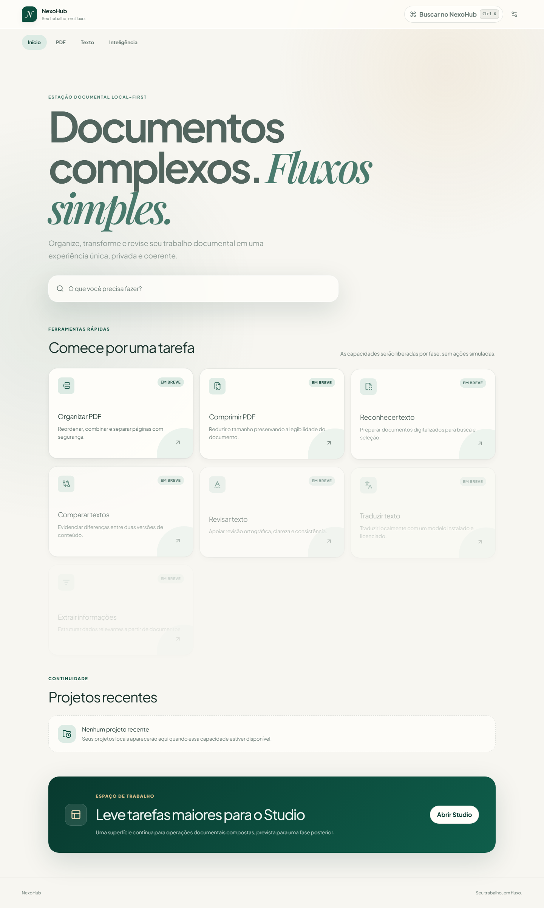
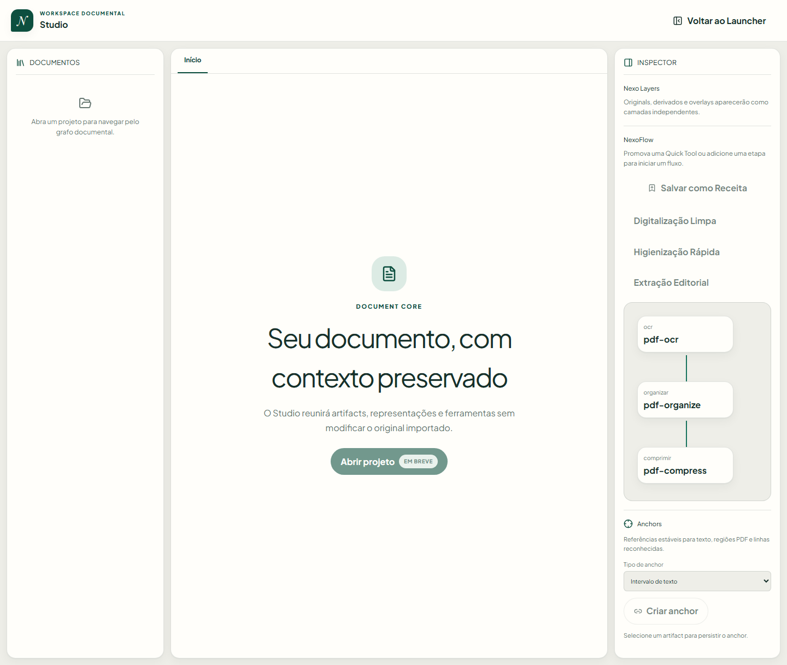

# NexoHub Community

<p align="center">
  <a href="https://github.com/junior-aguiar-eng/NexoHub/actions/workflows/main.yml">
    
  </a>
  <a href="https://github.com/junior-aguiar-eng/NexoHub/actions/workflows/ci.yml">
    
  </a>
  <a href="https://github.com/junior-aguiar-eng/NexoHub/actions/workflows/security.yml">
    
  </a>
  <a href="LICENSE">
    
  </a>
</p>

Estação documental **open source**, **local-first** e de **alta performance** para organizar projetos, preservar originais imutáveis e produzir novos artefatos derivados através de Quick Tools, Studio, automação visual (NexoFlow) e CLI.

> **Estado**: `0.1.0-alpha.1` em preparação e validação contínua. Build automatizado para Windows x64 ativo via GitHub Actions.

---

## 🖥️ Visão Geral e Superfícies

O NexoHub foi concebido em camadas especializadas, garantindo que o núcleo documental e os executores de tarefas sejam compartilhados entre a interface gráfica e o terminal:





### Superfícies do Produto

1. **Desktop Launcher (Tauri v2 + React 19)**:
   - Entrada rápida orientada a tarefas com **Quick Tools** reais (compressão, divisão, junção, OCR, conversão, metadados).
   - Gerenciamento de projetos locais e histórico recente sem conexão externa.
2. **Desktop Studio**:
   - Workspace documental avançado com visualizador multi-página, árvore de documentos, **Nexo Layers**, **NexoFlow** (DAG de pipelines visuais) e editor de texto imutável.
3. **CLI (@nexohub/cli)**:
   - Linha de comando para automação em scripts e terminal com comandos dedicados (`nexohub split`, `merge`, `compress`, `ocr`, `meta`, etc.), validada por suíte de testes automatizados.
4. **Engines Especializados**:
   - **Rust Core (`crates/`)**: I/O seguro de alta performance, verificação SHA-256, cancelamento atômico de operações e IPC tipado.
   - **Python Engine (`engines/python`)**: Sidecar isolado e gerenciado por `uv` (Python 3.14) provendo OCR (Tesseract), renderização e manipulação avançada com PyMuPDF.

---

## 🔒 Princípios de Privacidade e Modelo Local-First

- **Imutabilidade**: O arquivo original importado jamais é alterado ou sobrescrito; toda transformação produz um novo artefato derivado rastreável no Artifact Graph.
- **100% Offline e Local**: Não há telemetria invasiva, criação de conta obrigatória nem dependência de servidores remotos para funcionalidades locais.
- **Isolamento de Sidecars**: A interface do usuário não acessa o sistema de arquivos, SQLite ou processos nativos diretamente — toda interação é auditada através de portas de capacidade tipadas.
- A política completa de governança está detalhada em [`docs/PRIVACY.md`](docs/PRIVACY.md).

---

## 🚀 Instalação e Desenvolvimento

O alvo nativo principal de distribuição é **Windows x64**.

### Pré-requisitos
- **Node.js**: `24.19.0` (ou LTS equivalente)
- **pnpm**: `11.19.0`
- **Rust**: `1.88+` (com target `x86_64-pc-windows-msvc`)
- **Python / uv**: Python 3.14 gerenciado pelo `uv`
- **WebView2**: Runtime do Windows (já incluído no Windows 10/11)

### Configuração do Ambiente Local

```powershell
# 1. Instalar dependências JavaScript / TypeScript
pnpm install --frozen-lockfile

# 2. Sincronizar o ambiente isolado do Python sidecar via uv
uv sync --locked --project engines/python

# 3. Executar o aplicativo desktop em modo de desenvolvimento (Tauri + Vite)
pnpm --filter @nexohub/desktop dev
```

### Execução da CLI

```powershell
# Executar a CLI localmente
pnpm --filter @nexohub/cli test
```

### LanguageTool (Opcional para Revisão Gramatical)

```powershell
./scripts/install-languagetool.ps1 -InstallRoot "C:\NexoHub\LanguageTool"
$env:NEXOHUB_LANGUAGETOOL_DIR = "C:\NexoHub\LanguageTool"
```

---

## 🧪 Qualidade, Testes e CI/CD

O repositório mantém verificação contínua e estrita de qualidade em todos os pipelines:

```powershell
# Verificação de tipos e linter no ecossistema Web/Node
pnpm check
pnpm test
pnpm test:cli
pnpm build:web
pnpm test:e2e

# Verificação e testes do ecossistema Rust
cargo fmt --all --check
cargo clippy --workspace --all-targets --locked -- -D warnings
cargo test --workspace --locked

# Verificação e testes do ecossistema Python
uv run --locked --project engines/python ruff check .
uv run --locked --project engines/python pytest

# Auditoria estrita de licenças de dependências
pnpm licenses:check
```

### Workflows do GitHub Actions
- **Pipeline Main**: Executado em push para a `main` em dois estágios sequenciais — validação da CLI diretamente do código e empacotamento do executável Windows (`app-x64.exe`).
- **CI**: Execução cruzada de testes de JavaScript/Playwright, Python 3.14 e compilação completa do Rust no Windows.
- **Segurança e Licenças**: Varredura de segredos (Gitleaks), auditoria de vulnerabilidades (`cargo-deny`) e conformidade de licenças (`audit-licenses.mjs`).

---

## 📚 Documentação e Arquitetura

- [Arquitetura Geral](docs/ARCHITECTURE.md)
- [Critérios de Conclusão (Definition of Done)](docs/DEFINITION-OF-DONE.md)
- [Roadmap de Desenvolvimento](docs/ROADMAP.md)
- [Guia de Contribuição](CONTRIBUTING.md)
- [Histórico de Mudanças (Changelog)](CHANGELOG.md)
- [Licenças de Terceiros](THIRD_PARTY_LICENSES.md)

---

## 📄 Licença

Distribuído sob a licença **MPL-2.0** (Mozilla Public License 2.0). Veja [LICENSE](LICENSE) para mais detalhes.
